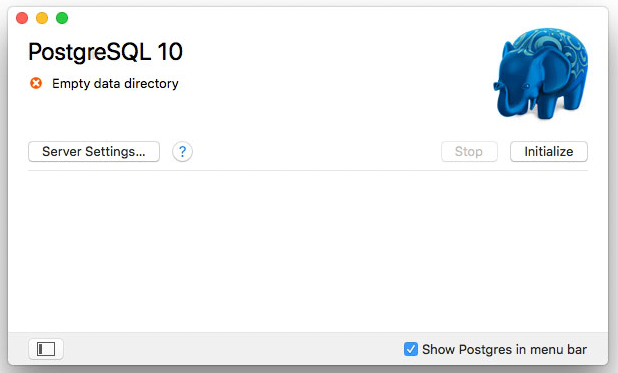
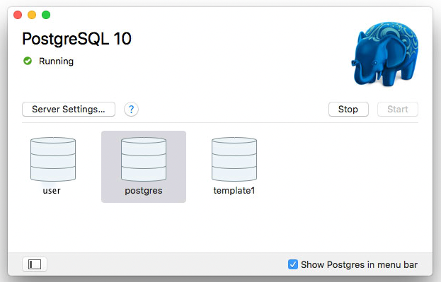
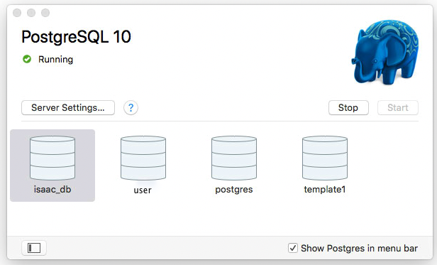
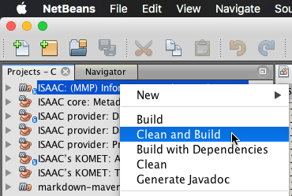
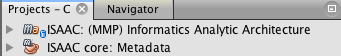

# ISAAC PostgreSQL Notes

<a id="toc"></a>
[Setup](#Setup) •
[Run KOMET Application](#RunApp) •
[Command Line Launch](#CliLaunch) •
[SQL Trace Logging](#SqlLogging) •
[Resources](#Resources)

> The example below are based on a macOS High Sierra computer which has [Java SE JDK 1.8](https://www.oracle.com/technetwork/java/javase/downloads/index.html), [Apache Maven 3.5.4](https://maven.apache.org/download.cgi) and [Netbeans IDE 8.2](https://netbeans.org/downloads/) installed.  The [Postgres.app](https://postgresapp.com/) is shown as the PostgreSQL installation.

## Setup <a id="Setup">[▴](#toc)</a>

**Step A.1. Setup PostgreSQL**

Download [Postgres.app](https://postgresapp.com/downloads.html) with PostgreSQL 9.5, 9.6, 10 and 11. Mount Postgres-2.1.5.dmg. Drag Postgres.app to the /Applications folder.

Configure `$PATH` in a terminal window:

``` sh
sudo mkdir -p /etc/paths.d &&
echo /Applications/Postgres.app/Contents/Versions/latest/bin | \
sudo tee /etc/paths.d/postgresapp
```

Close and reopen the terminal window for the `$PATH` change to take effect. Verify `$PATH` to `psql` in the new terminal window.

``` sh
which -a psql
# /Applications/Postgres.app/Contents/Versions/latest/bin/psql
psql --version
# psql (PostgreSQL) 10.5
```

Launch Postgres.app.



Click "Initialize".



In the terminal, log into PostgreSQL via `psql`.

``` sh
psql --username=$USER
```

At the `psql` prompt, create the `isaac_user` user and `isaac_db` database.

``` sql
CREATE DATABASE isaac_db;
CREATE USER isaac_user WITH ENCRYPTED PASSWORD 'isaac_pwd';
GRANT ALL PRIVILEGES ON DATABASE isaac_db TO isaac_user;
```



A double click the `isaac_db` image in the Postgres.app window will launch a terminal command line instance logged into `isaac_db`.

**Step A.2. Setup Maven `postgres` Profile**

Download and install [Apache Maven](https://maven.apache.org/download.cgi).

Edit `~/.m2/settings.xml` with `nano` or some other [plain text editor](https://github.com/coteditor/CotEditor). Add the following XML lines to _settings.xml_.  The `explicit-datstore` property tells ISAAC to use the PostgreSQL database backend instead of the FileStore backend.

``` xml
<profiles>
    <profile>
        <id>postgres</id>
        <properties>
            <explicit-datstore>postgres</explicit-datstore>
        </properties>
    </profile>
    <!-- ... other profiles -->
<profiles>
```

``` xml
<activeProfiles>
    <activeProfile>postgres</activeProfile>
    <!-- ... other active profiles -->
</activeProfiles>
```

**Step A.3. Install SQL Scripts**

Place the SQL scripts _[drop_all.sql](README_files/sql_scripts/drop_all.sql)_ and _[stats.sql](README_files/sql_scripts/stats.sql)_ somewhere convenient for command line use, for example `~/psql`. The `~/psql` directory is used in the following examples.

``` sh
mkdir ~/psql
# copy or move in SQL scripts
```

* _[drop_all.sql](README_files/sql_scripts/drop_all.sql)_ drops all tables in the database.
* _[stats.sql](README_files/sql_scripts/stats.sql)_ queries for a row count of the tables in `isaac_db`.

``` sh
psql -p5432 --username=isaac_user --dbname=isaac_db
#psql (10.5)
#Type "help" for help.

isaac_db=#\i psql/stat.sql
isaac_db=#\i psql/drop_all.sql
```

**Step A.4. Setup ISAAC Project**

Clone to download the [OSEHRA/ISAAC](https://github.com/OSEHRA/ISAAC) git repository to the local machine.

## Run KOMET Application <a id="RunApp">[▴](#toc)</a>

**Step B.1. Clean & Build ISAAC: (MMP) Informatics Analytic Architecture**

Clean & build _ISAAC: (MMP) Informatics Analytic Architecture_ project. Clean and Build can be done from the IDE or command line.



``` sh
cd /PATH_TO/ISAAC
mvn --errors clean install
```

**Step B.2. Drop Database Tables**

When either the _ISAAC: (MMP) Informatics Analytic Architecture_ or _ISAAC: core metadata_ projects are built, then the `isaac_db` table are populated with data. This test data needs to be cleared before running KOMET.



Verify that the `isaac_db` database is empty with either `\d` or `\i psql/stats.sql`. Use [drop_all.sql](README_files/sql_scripts/drop_all.sql) to clear the `isaac_db` database is if not empty.

``` sh
isaac_db=#\i psql/stats.sql
isaac_db=#\i psql/drop_all.sql
isaac_db=#\d
# verify: "did not find any relations.""
```

**Step B.3. Run ISAAC KOMET**

Verify that the `isaac_db` database is empty prior to building and running the ISAAC KOMET application. (see step 2.)

The ISAAC KOMET application module can can be built without requiring a full build of the parent MMP project.

``` sh
cd /PATH_TO/KOMET
mvn --errors clean install
```
Change the configuration of ISAAC KOMET to `postgres-datastore`.


Run ISAAC KOMET application.


## Command Line Launch <a id="CliLaunch">[▴](#toc)</a>

If launched from the command line or script the PostgreSQL database name, username and user password can be provided as properties.  

* `ISAAC_PSQL_URL` Database URL in the format **`jdbc:postgresql://host:port/database`**. Default: `jdbc:postgresql://localhost/isaac_db`
* `ISAAC_PSQL_UNAME` User name with PostgreSQL privileges. Default: **`isaac_user `**
* `ISAAC_PSQL_UPWD`  User password. Default: **`isaac_pwd`**

The properties can be provided on the command line.

``` ini
-DISAAC_PSQL_URL='jdbc:postgresql://localhost/isaac_db'
-DISAAC_PSQL_UNAME='isaac_user'
-DISAAC_PSQL_UPWD='isaac_pwd'
```

If the properties are not found, then defaults will be used.

``` java
String isaacDbUrl    = System.getProperty("ISAAC_PSQL_URL", "jdbc:postgresql://localhost/isaac_db");
String isaacUsername = System.getProperty("ISAAC_PSQL_UNAME", "isaac_user");
String isaacUserpwd  = System.getProperty("ISAAC_PSQL_UPWD", "isaac_pwd");
```

## SQL Trace Logging <a id="SqlLogging">[▴](#toc)</a>

Note: For full logging of java generated SQL statements, find and set `LOG_SQL_FLAG` to true and rebuild the project.

``` java
private static final boolean LOG_SQL_FLAG = false;
```

## Resources <a id="Resources">[▴](#toc)</a>

* [Apache Maven ⇗](https://maven.apache.org/download.cgi)
* [Apache Doxia Markdown ⇗](https://maven.apache.org/doxia/doxia/doxia-modules/doxia-module-markdown/)
* [CotEditor ⇗](https://github.com/coteditor/CotEditor) open-source plain text editor
* [Netbeans IDE ⇗](https://netbeans.org/downloads/)
* [Oracle Java SE JDK ⇗](https://www.oracle.com/technetwork/java/javase/downloads/index.html)
* [GitHub: OSEHRA/ISAAC ⇗](https://github.com/OSEHRA/ISAAC)
* [Postgres.app ⇗](https://postgresapp.com/)

